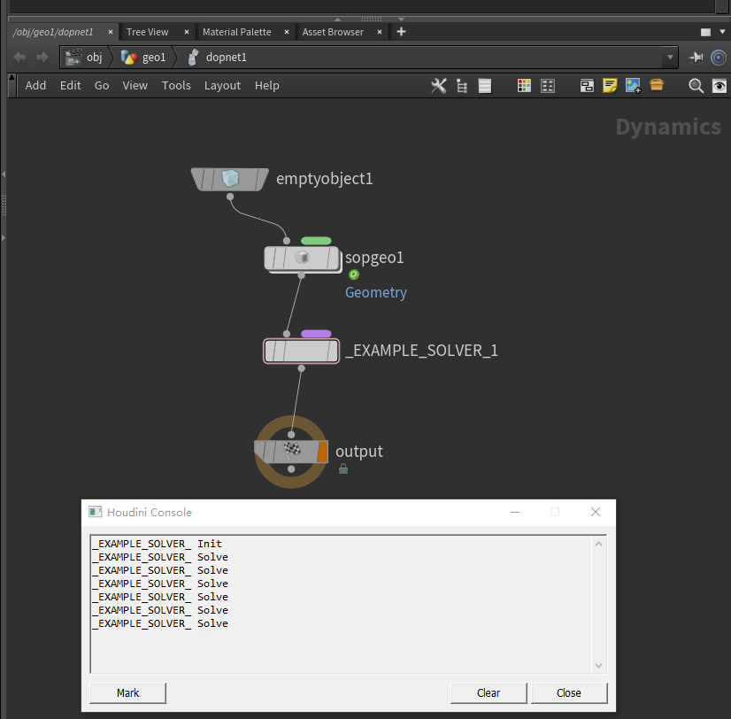

# Houdini Solver Generator

This is a generator for Houdini Solver Plugin.

Usage:

```shell
python mk.py <YourSolverName>
```

It generates:

```
- <YourSolverName>
	- houdini
		- AttribHelper.h
		- DLLEntrance.cpp
		- SIM_<YourSolverName>_.cpp
		_ SIM_<YourSolverName>_.h
	- CMakeLists.txt
```

and do anything for you to set up a basic solver plugin.


Note :information_source:: 

1. Remember to set your Environment Variable to find the HDK.

```
HOUDINI_Root=<Your Houdini Install Path>
e.g.
HOUDINI_Root="D:/houdini"
```

2. HDK only supports `ReleaseWithDebugInfo / Release` Mode


## Quick View

- Enter Folder [Template](./Template)
- Build with CMake
- Compile with mode "ReleaseWithDebugInfo"
- Enter Folder [Template/hip](./Template/hip)

- Double Click [Template/hip/example.hip](./Template/hip/example.hip)

